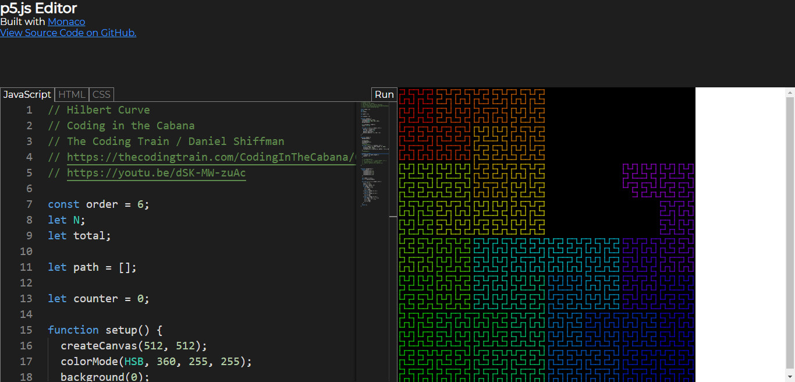

# p5.js Web Editor, created with Monaco Editor

- [p5.js](https://p5js.org)
- [monaco editor](https://microsoft.github.io/monaco-editor/)

## Todo / Bugs

- No Autocomplete for extra p5 classes (`p5.Vector`)
- Console
- Settings (Font Size, Theme, Line Numbers, Wrap)
